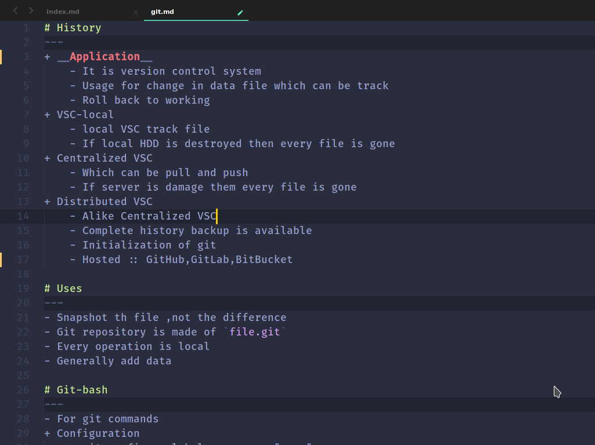

## Welcome to Notes Pages

Whenever you commit to this repository, GitHub Pages will run [Jekyll](https://jekyllrb.com/) to rebuild the pages in your site, from the content in your Markdown files.
### Jekyll Themes

Your Pages site will use the layout and styles from the Jekyll theme you have selected in your [repository settings](https://github.com/Piyush-linux/Notes/settings). The name of this theme is saved in the Jekyll `_config.yml` configuration file.

### Support or Contact

Having trouble with Pages? Check out our [documentation](https://docs.github.com/categories/github-pages-basics/) or [contact support](https://github.com/contact) and we’ll help you sort it out.

# Index
1. [GIT](https://github.com/Piyush-linux/Notes/blob/master/linux/git.md)

GIT

- `git rm -rf .git` : Git repo deleted
  - `git log -p / git` log -np / 
- `git log -stat` : In short commit with details
- `--pretty=short` : all commit with detail
1. `--pretty=full` :
2. `since=2.day` : commit in two day's 
- `--pretty=format` : "%h --%an"
- `git commit -amend` : to make change

---

---

---

